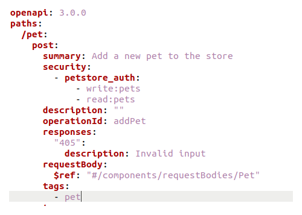
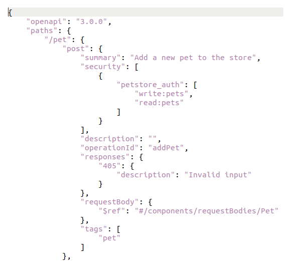
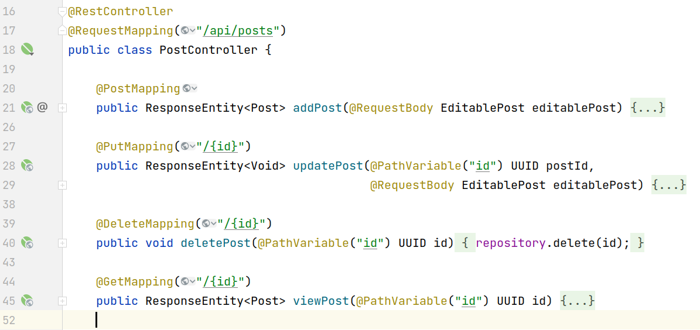
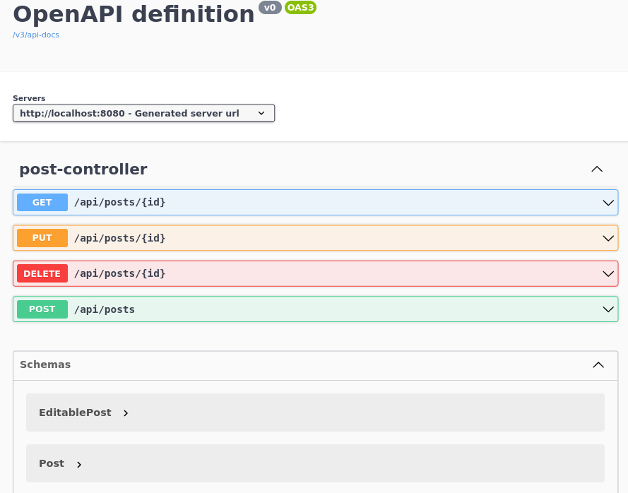
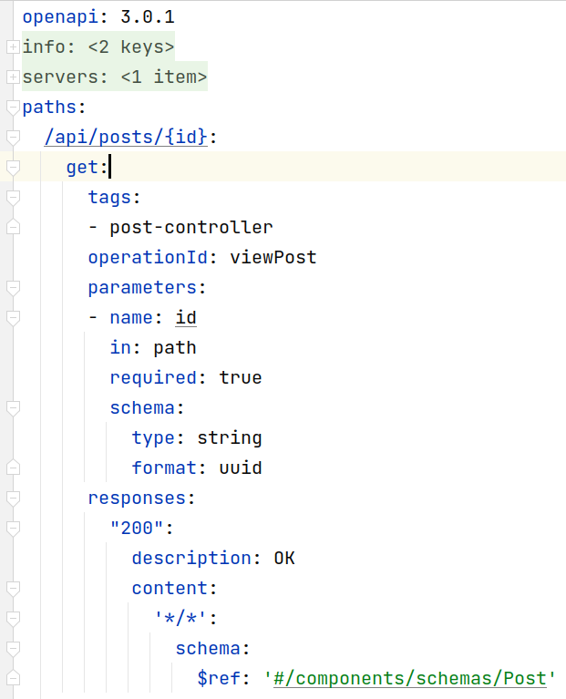

# Koncentrat OpenAPI

---

## O mnie

* Mariusz Wyszomierski
* 14 lat doświadczenia w IT
* Architekt w Centralnym Ośrodku Informatyki

Note: zaczynałem od prowadzenia firmy, która robiła strony internetowe, aplikacje webowe w oparciu o PHP.
Programista głównie Java, Team lider
Tata dwóch córeczek (lvl 1 i lvl 3)

----

## Kontakt

Twitter: <a href="https://twitter.com/speedlogPL" target="_blank">https://twitter.com/speedlogPL</a>  
LinkedIn: <a href="https://www.linkedin.com/in/mariuszwyszomierski" target="_blank">https://www.linkedin.com/in/mariuszwyszomierski</a>  
Blog: <a href="https://mariusz.wyszomierski.pl" target="_blank">mariusz.wyszomierski.pl</a>  
E-mail: <a href="mailto:mariusz@wyszomierski.pl" target="_blank">mariusz@wyszomierski.pl</a>  
GitHub: <a href="https://github.com/speedlog" target="_blank">https://github.com/speedlog</a>

Note: Można robić zdjęcie :-)

---

## Zaczynamy


Note: 

Dziękuję za obecność na mojej prelekcji. Jest to pierwsze moje wystąpienie na konferencji, ale mimo to mam nadzieję że nie będzie odstawało od reszty prezentacji.
Mimo formy zdalnej nadal towarzycy mi lekka trema, więc z góry wybaczcie jeżeli coś przekręcę lub zacznę się jąkać ;)

Na koniec podzielę się z Wami ile zajęło mi przygotowanie tej prezentacji i materiałów 
do niej. 
Prezentacja zostanie tez udostępniona za kilka dni na github o czym bede informował na twiterze i LinkedIn.

źródło obrazka https://commons.wikimedia.org/wiki/File:Cartoon_space_rocket.png#filelinks

---

## O czym będzie prezentacja?

* praktyczne użycie OpenAPI z różnych perspektyw
* narzędzia
* wady i zalety różych rozwiązań

Note: W dużym skrócie o tym jak można dokumentować API usług wystawionych po HTTP. Jakie są standardy. Jakie narzędzia i możliwości tworzenia oraz używania OpenAPI. Perspektywa wad, zalet i puapek na które trzeba uważać. 

----

## Czego nie będzie na prezentacji?

* czytania dokumentacji ;)
* ~~live coding~~
* ~~demo~~

Note: 

Nawet obejrzałem w ramach przogotwać bardzo fajne szkolenie DevSpeakers od Maćka Aniserowicza.
I bardzo dobrze - nie będzie demo i live codingu ;)
Za to jak widzicie prezentacja jest na ciemnym tle. Stwierdziłem, że skoro prelekcja jest prowadzona w trybie zdalnym i nie będzie prezentowana przez projektor to mogę sobie pozwolić na odstępstwo :)

Starałem się przygotować prezentacje w 
taki sposób, aby osoby które na codzień nie korzystają lub będą słyszały o OpenAPI po raz pierwszy mogły mimo wszytsko skorzystać z tej prezentacji. 

---

## OpenAPI 

OpenAPI to standard opisu kontraktu API opartego o HTTP głównie może być kojarzony z usługami REST.  
Standard ten jest rozwijany przez community. Opis specyfikacji można znaleźć na GitHub.  
Specyfikacja jest niezależna od technologii aplikacji, która wystawia/konsumuje usługi.

<a href="https://spec.openapis.org/oas/v3.1.0" target="_blank">https://spec.openapis.org/oas/v3.1.0</a>
<a href="https://github.com/OAI/OpenAPI-Specification" target="_blank">https://github.com/OAI/OpenAPI-Specification</a>

---

## Czym jest kontrakt?

* SOAP -> WSDL
* REST -> OpenAPI 
* GraphQL-> schema

Note: 

plik lub zestaw plików zawierających opis endpointów, danych wejściowych i wyjściowych, walidacji.

---

## Po co mi kontrakt?

* dokumentacja API czytelna zarówno przez człowieka jak i przez różne narzędzia
* brak konieczności odkrywania API metodą empiryczną
* zwiększa prawdopodobieństwo właściwej integracji

Note: 

Warto tutaj zainteresować się testami kontraktowymi. Dwa chyba najbardziej popularne narzędzie to Spring Cloud Contract oraz Packt.
Dzięki agnostyczności od technologii kontrakt może tworzyć zarówno zespół backend/frontend/architekci/analitycy.

---

## Swagger - ojciec OpenAPI

Firma SmartBear (Ci od SoapUI) jest twórcą specyfikacji "Swagger Spec 2.0", która została upubliczniona w 2014 roku.
W 2015 roku firma SmartBear przekazała projekt organizacji OpenAPI Initiative.
W 2017 roku została wydana oficjalna wersja OpenAPI 3.

Note: 

Organizacja OpenAPI Initiative jest złożona ze specjalistów z róznych organizacji Microsoft, IBM, SmartBear, RedHat.
Swagger obecnie może być kojarzany z zestawem narzędzi wspomagających pracę z OpenAPI.
Chyba najpopularniejszym narzędziem jest swagger-ui o którym będę wspominał później.
Często do tej pory można usłyszeć w rozmowach "podeślij mi tego swaggera"

---

## Wersje OpenAPI

* Aktualna wersja to 3.1.0 (data wydania 16.02.2021)
* Nie wszystkie narzędzia są kompatybilne z najnowszą wersją dlatego, jeżeli nie potrzebujesz zmian z najnowszej wersji to warto rozważyć pozostanie przy wersji 3.0.x

---

## Interaktywna przeglądarka struktury OpenAPI

<a href="http://openapi-map.apihandyman.io/" target="_blank">http://openapi-map.apihandyman.io/</a>

---

## Zmiany wprowadzone w wersji 3.1

* dodanie obsługi webhook
* możliwość dokumentowania pól, które są referencją do obiektu
* nowy typ uwierzytelnienia - `mutualTLS`

<a href="https://github.com/OAI/OpenAPI-Specification/releases" target="_blank">https://github.com/OAI/OpenAPI-Specification/releases</a>

---

## Zmiany wprowadzone w wersji 3.1

* możliwość zdefiniowania listy ról potrzebnych do wywołania danego endpointa
* atrybut `nullable` -> na typ `null`
* format - dla pliku nie używa się już `byte`, `binary` i `base64`. Nowe pola: `contentEncoding` i `contentMediaType`

<a href="https://github.com/OAI/OpenAPI-Specification/releases" target="_blank">https://github.com/OAI/OpenAPI-Specification/releases</a>

---

## Zmiany wprowadzone w wersji 3.1

Poradnik migracji 3.0 -> 3.1

1. <a href="https://www.openapis.org/blog/2021/02/16/migrating-from-openapi-3-0-to-3-1-0" target="_blank">https://www.openapis.org/blog/2021/02/16/migrating-from-openapi-3-0-to-3-1-0</a>
1. <a href="https://www.apimatic.io/blog/2021/09/migrating-to-and-from-openapi-3-1" target="_blank">https://www.apimatic.io/blog/2021/09/migrating-to-and-from-openapi-3-1/</a>

----

## Jak wygląda kontrakt?

Format YAML  


----

## Jak wygląda kontrakt?

Format JSON  


----

## Pytanie do publiczności nr 1


<a href="https://t.ly/fEGk" target="_blank">t.ly/fEGk</a>

---

### Konwersja YAML->JSON i JSON->YAML

* JSON to YAML
 ```bash
 yq r --prettyPrint contract.json
 ```
* YAML to JSON
 ```bash
 yq r --prettyPrint -j contract.yaml
 ```
 
<a href="https://github.com/mikefarah/yq" target="_blank">https://github.com/mikefarah/yq</a>

Note: lub opcja w IntelliJ

----

## Konwersja swagger->OpenAPI

```bash
swagger2openapi -y -o openapi.yml swagger.json 
```

<a href="https://github.com/olegklimakov/swagger2openapi" target="_blank">https://github.com/olegklimakov/swagger2openapi</a>


Note: Instalacja za pomocą npm

---

## Jak tworzyć kontrakt?

* code first
* contract first

---

## Code first

Generator kontraktu na podstawie kodu i adnotacji.  
<a href="https://springdoc.org" target="_blank">https://springdoc.org</a>  

> **Ostrzeżenie**  
> Jeżeli chcesz użyć tej biblioteki ze Spring Boot >= 3 to musisz użyć wersji >= 2


```
implementation 'org.springdoc:springdoc-openapi-starter-webmvc-ui:2.1.0'
```

----

## Code first - przykładowy RestController



----

## Code first - swagger-ui

<a href="http://localhost:8080/swagger-ui.html" target="_blank">localhost:8080<span style="color: yellow">/swagger-ui.html</span></a>




Note: anegdotka - szwagier

----

## Code first - kontrakt



----

## Code first - współpraca

* standardowo kontrakt generowany jest w runtime
  ```gradle
  plugins {
	id 'org.springdoc.openapi-gradle-plugin' version "1.6.0"
  }
  ```
* release kontraktu jako artefakt
* śledzenie zmian w wygenerowanym kontrakcie
  ```gradle
  openApi {
      // if you want to YAML format
  	apiDocsUrl.set("http://localhost:8080/v3/api-docs.yaml")
      // generate to directory which is not ignored by git
      outputDir.set(file("$projectDir/src/main/resources/openapi"))
      outputFileName.set("post_contract.yaml")
  }
  ```

---

## Code first - współpraca

Warto dodać task `generateOpenApiDocs` do procesu budowania aplikacji.

```
tasks.build.dependsOn { tasks.generateOpenApiDocs }
tasks.test.dependsOn { tasks.generateOpenApiDocs }
```

Note: uwaga - to podejście ma wady. Ktoś może nie zrobić builda/testów przed commitem.
Niektóre pluginy sprawdzają podczas release czy w repo podczas builda pojawiły się zmiany w plikach.
TODO: Rozwiązaniem może być pre-commit hook lub dodatkowy krok w pipeline sprawdzający czy nie pojawił się plik.

---

## Contract first

Odwrotna strategia. Najpierw tworzymy kontrakt i go releasujemy.
Następnie z kontraktu generowany jest kod.
	
----

## Contract first - narzędzia

Edytory wspomagające tworzenie API:
* Visual Studio Code
	* <a href="https://marketplace.visualstudio.com/items?itemName=42Crunch.vscode-openapi" target="_blank">https://marketplace.visualstudio.com/items?itemName=42Crunch.vscode-openapi</a>
	* <a href="https://marketplace.visualstudio.com/items?itemName=Redocly.openapi-vs-code" target="_blank">https://marketplace.visualstudio.com/items?itemName=Redocly.openapi-vs-code</a>

----

## Contract first - narzędzia

Edytory wspomagające tworzenie API:
* Eclipse
	* <a href="https://github.com/RepreZen/KaiZen-OpenAPI-Editor" target="_blank">https://github.com/RepreZen/KaiZen-OpenAPI-Editor</a>

----

## Contract first - narzędzia

Edytory wspomagające tworzenie API:
* IntelliJ IDEA
	* Community Edition + plugin <a href="https://plugins.jetbrains.com/plugin/14837-openapi-swagger-editor" target="_blank">https://plugins.jetbrains.com/plugin/14837-openapi-swagger-editor</a>
	* Ultimate - wbudowany plugin obsługujący OpenAPI

----

## Contract first - narzędzia

Edytor online:
* <a href="https://editor.swagger.io" target="_blank">https://editor.swagger.io</a>
* <a href="https://editor-next.swagger.io/" target="_blank">https://editor-next.swagger.io/</a>

----

## Contract first - narzędzia

GUI wspomagające tworzenie API:
* <a href="https://github.com/Apicurio/apicurio-studio" target="_blank">https://github.com/Apicurio/apicurio-studio</a> - open source, można postawić samemu, możliwa współpraca. <a href="https://studio.apicur.io" target="_blank">Demo</a>
* wersja mini `apicurito`: <a href="https://www.apicur.io/apicurito/pwa/" target="_blank">https://www.apicur.io/apicurito/pwa/</a>

Note: Apicurio jest sponsorowane przez RedHat.
Apicurito ostatnia wersja wydana została dosyć dawno bo w październiku 2020 
docker run -it -p 8080:8080 apicurio/apicurito-ui
Szykowany jest następca wersji studio: apicurio-api-designer

----

## Contract first - narzędzia

GUI wspomagające tworzenie API:
* Stoplight Studio: <a href="https://stoplight.io/studio" target="_blank">https://stoplight.io/studio</a> - **darmowe dla 1 usera**

----

## Contract first - narzędzia

GUI wspomagające tworzenie API:
* Apibldr: <a href="https://www.apibldr.com/" target="_blank">https://www.apibldr.com/</a> - online, darmowe, nie jest opensource

---

## Pytanie do publiczności nr 2


<a href="https://t.ly/ihP3" target="_blank">t.ly/ihP3</a>

---

## Przykładowe kontrakty

* https://petstore.swagger.io/
* https://developer.allegro.pl/swagger.yaml
* https://developer.spotify.com/_data/documentation/web-api/reference/open-api-schema.yml
* https://github.com/OAI/OpenAPI-Specification/tree/main/examples

---

## Dekompozycja kontraktu

* Kontrakt OpenAPI może być złożony z kilku plików
* Mogą zostać dołączone pliki lokalne lub zdalne

Note: 
Po co korzystać z kompozycji?
Współdzielenie obiektów pomiędzy różnymi endpointami.
Współdzielenie obiektów pomiędzy kontraktami.

A po co dzielić kontrakty?
Dobra praktyka. Nie wszyscy integratorzy potrzebują znać całe API.

Jakie jest ryzyko? 
Nie wiadomo na jakie API dana zmiana ma wpływ.

----

## Dekompozycja kontraktu - contract first

Podstawowym sposobem dekompozycji jest umieszczanie wspólnych obiektów w sekcji "components".  
Mogą to być parametry metody, treść body żądania, odpowiedzi, nagłówki HTTP i inne.  

Przykład dekompozycji na podstawie plików:
* post_contract_without_refs.yaml
* post_contract_with_refs.yaml

----

## Dekompozycja kontraktu - contract first

Przykład referencji z zewnątrz pliku.  
Patrz: request body w metodzie PUT dla endpointa /api/posts/{id}

Note:
Wadą tego rozwiązania jest to, że nie wszystkie narzędzia mogą obsługiwać referencje z zewnętrznych plików.
Np. edytor online swaggera.
Z rozwiązania korzysta się głównie, jeżeli mamy obiekty współdzielone pomiędzy różnymi plikami kontraktów.

----

## Dekompozycja kontraktu - contract first

Przykład referencji po URL.  
* post_contract_with_remote_url_refs.yaml

Note: 

Do czego wykorzystywać pliki zdalne?
Wspólny model danych pomiędzy różnymi systemami.
Brak kontroli nad tym jak zmiana niekompatybilna może wpłynąć na inne API (bo nie wiemy kto z nich korzysta).
Dlatego przy tego typu rozwiązaniach najlepiej nie wprowadzać zmian niekompatybilnych :-)

----

## Kompozycja kontraktu - połączenie w jeden plik

* w przypadku kontraktu z referencjami odwołującymi się po zdalnych URL
https://editor-next.swagger.io/
* w przypadku kontraktu z referenacjami do plików można użyć opcji IntelliJ (Export Self-Contained Specification)

Note:
Zawsze warto przejrzeć w jaki sposób plik został scalony i jakie nazwy zostały nadane poszczególnym obiektom.

----

## Kompozycja kontraktu - code first

W przypadku podejścia "code first" kompozycja kontraktu na wiele plików nie ma sensu.
Kompozycją są tutaj po prostu oddzielne pliki Java.

---

## Narzędzia wokół OpenAPI

* generowanie kodu klienta oraz serwera
* walidacja poprawności kontraktu
* walidacja zgodności request/response z kontraktem
* generowanie dokumentacji
* generowanie stubów z kontraktów
* generowane kontraktów z requestów HTTP
* konwertowanie do różnych formatów

<a href="https://openapi.tools/" target="_blank">https://openapi.tools/</a>

----

## Generowanie kodu

* <a href="https://openapi-generator.tech/" target="_blank">https://openapi-generator.tech/</a>  
* <a href="https://github.com/swagger-api/swagger-codegen" target="_blank">https://github.com/swagger-api/swagger-codegen</a>

Note:
Projekty to generatory oparte o szablony (możliwość generowania klienta lub serwera).
openapi-generator to fork projektu swagger-codegen

----

## Generowanie strony serwerowej Spring Boot 3

```
openApiGenerate {
	// opcje pluginu
	generatorName = "spring"
	inputSpec = "$rootDir/src/main/resources/openapi/post_contract_with_refs.yaml".toString()
	
	...
	// opcje generatora
	configOptions = [
			dateLibrary: "java8",
			useSpringBoot3: "true"
	]
}
```
----

## Generowanie strony serwerowej Spring Boot 3

* Opcje pluginu: <a href="https://github.com/OpenAPITools/openapi-generator/blob/master/modules/openapi-generator-gradle-plugin/README.adoc" target="_blank">https://github.com/OpenAPITools/openapi-generator/blob/master/modules/openapi-generator-gradle-plugin/README.adoc</a>
* Opcje generatora: <a href="https://openapi-generator.tech/docs/generators/spring" target="_blank">https://openapi-generator.tech/docs/generators/spring</a>

Note:
Wspomnieć o dodanie sourcesSet
Wspomnieć o zależnościach w maven

----

## Walidacja kontraktu

<a href="https://openapi-generator.tech/docs/generators/spring" target="_blank">https://github.com/stoplightio/spectral</a>

Note: 

Poprzednio wspomniany plugin ma też opcję walidacji kontraktu ze standardem OpenAPI.
Narzędzie, które pokażę potrafi nieco więcej - potrafi pilnować pewnych ustalonych reguł np. nazwnictwa oraz wskazywać potencjalne błędy bezpieczeństwa.

----

## Walidacja kontraktu

```
# install spectral tool
npm install -g @stoplight/spectral-cli

# generate file with rules
echo 'extends: ["spectral:oas", "spectral:asyncapi"]' > .spectral.yaml

# validate contract
spectral lint post_contract_with_refs.yaml 
```

Note:
Gdzie podpiąć: build lokalny, pipe-line, pre-commit hook.

----

## Walidacja kontraktu

Gotowe zbiory reguł:
* <a href="https://apistylebook.stoplight.io/docs/" target="_blank">https://apistylebook.stoplight.io/docs/</a>
* <a href="https://github.com/apisyouwonthate/style-guide" target="_blank">https://github.com/apisyouwonthate/style-guide</a>
* <a href="https://github.com/adidas/api-guidelines/blob/master/.spectral.yml" target="_blank">https://github.com/adidas/api-guidelines/blob/master/.spectral.yml</a>

Możliwe użycia:
* <a href="https://github.com/adidas/api-guidelines/blob/master/.spectral.yml" target="_blank">https://meta.stoplight.io/docs/spectral/7895ff1196448-sharing-and-distributing-rulesets</a>

Note:

Można użyć plików lokalnych, zdalnych lub paczek zainstalowanych jako moduł npm.

----

## Walidacja kontraktu - customowa reguła

Numer PESEL nie może znaleźć się w URL (nie może być parametrem PATH lub QUERY)

```
rules:
  coi-path-or-query-parameters-shoud-not-contain-PESEL:
    description: Path or query parameters SHOULD NOT contain PESEL
    severity: warn
    recommended: true
    message: "{{property}} path parameter: {{error}}"
    given: $..parameters[?(@.in == 'path' || @.in == 'query')].name
    then:
      function: pattern
      functionOptions:
        notMatch: "/.*pesel.*/i"
```

----

## Walidacja kontraktu - pipeline

```
stage('Lint OpenAPI') {
	def statusCode = sh(script: 'docker run --rm -v $(pwd)/src/main/resources:/tmp stoplight/spectral lint --ruleset /tmp/.spectral.yaml /tmp/srp-micro-pesel-contract.yaml', returnStatus: true)
	if (statusCode != 0) {
		currentBuild.result = 'FAILED'
		step([$class: 'StashNotifier'])
		error("Walidacja kontraktu zwróciła błędy - sprawdź logi...")
	}
}
```

---

## Github - przykłady i prezentacja

<a href="https://github.com/speedlog/openapi-presentation" target="_blank">https://github.com/speedlog/openapi-presentation</a>

---

# Q & A

---

## Dziękuję i o feedback proszę


<a href="https://t.ly/yNyWg" target="_blank">t.ly/yNyWg</a>

---

# KONIEC :-)

Note:
Link do prezentacji wyników:
https://docs.google.com/forms/u/0/?tgif=d

TODO:
* Zmiany kompatbyline i niekompatybilne (enum i java) - https://stackoverflow.com/a/55054473
* examplesy w kontraktach
* zwracanie plików binarnych
* oneOf, anyOf, allOf
* walidacja danych wyjściowych z usługi
* swagger-ui przy podejściu conctract-first. Obsługa blokady podawania url w nowym swagger-ui.
* springdoc - głębsze omówienie ciekawszych opcji
- wyłączenie swagger-ui po co?
- wskazanie z któryc kontrolerów
- generowanie wspólnych obiektów
* dodanie README do projektów Spring Boot
* dodanie README jak uruchomić prezentację
? prezentacja w formie PDF na github
* do sprawdzenia opcja "export self contained" w IntelliJ w przypadku scalenia kilku kontraktów w jeden. Czy tylko płatna i czy pluginy w IntelliJ i VSC też oferują taką opcję
* pododawać opisy w kontraktach (również tych generowanych z kodu)
* pododawać inne kody odpowiedzi (błędów)
* sprawdzić lintem kontrakty z obu przykładów code/contract first
* stopka na każdej stronie z twitter i www
* dystrybucja kontraktu - wspomnieć więcej o tym jak może być dystrybuowany (osobny artefakt)
* rozbudowa przykładowych aplikacji np. o obsługę błędów walidacji
* podbic revealmd do 5.5.0 i przetestować prezentację

Narzędzia:
https://inspector.swagger.io
https://petstore.swagger.io (swagger ui)


Inne ciekawe linki:
https://idratherbewriting.com/learnapidoc/openapi_tutorial.html
https://www.postman.com/state-of-api/api-first-strategies/#api-first-strategies
https://quobix.com/vacuum/


